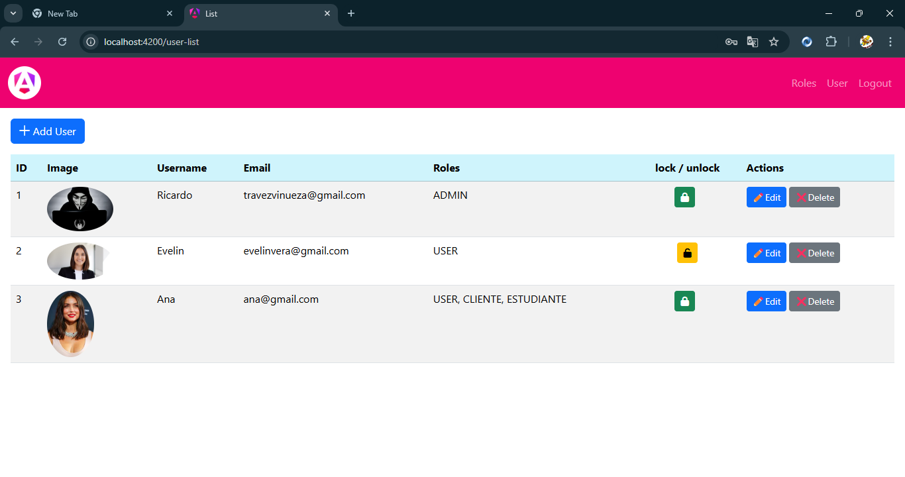
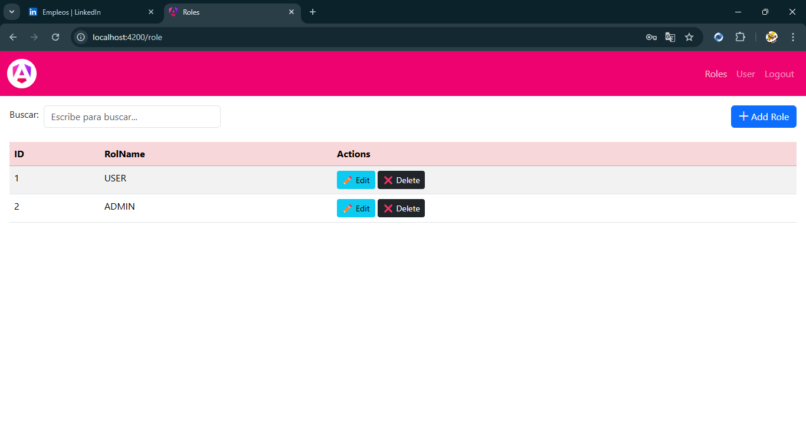
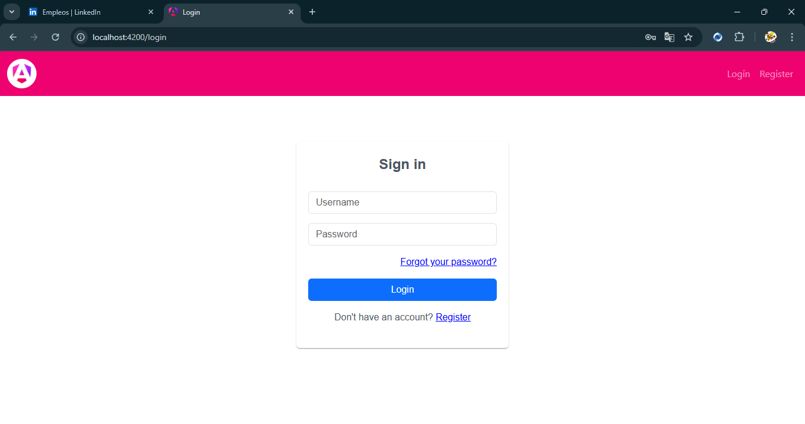
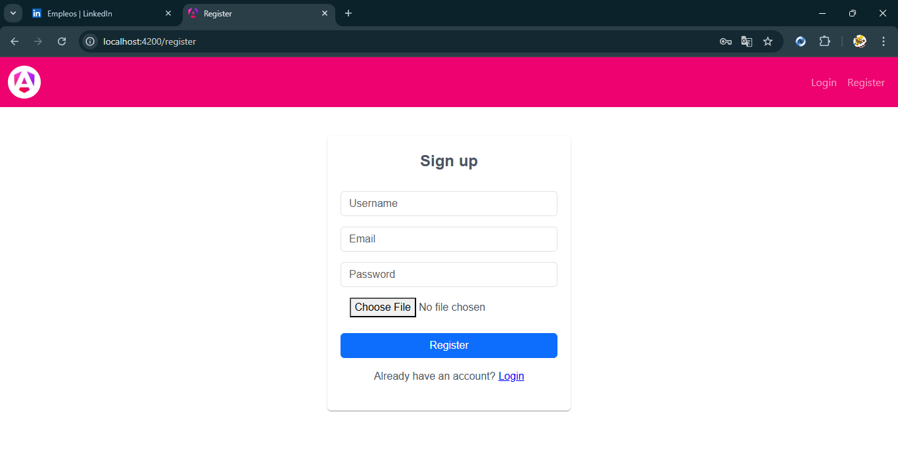
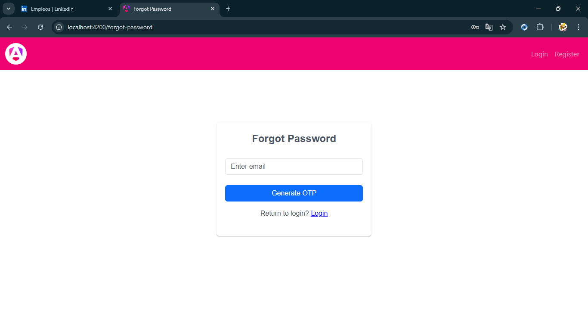
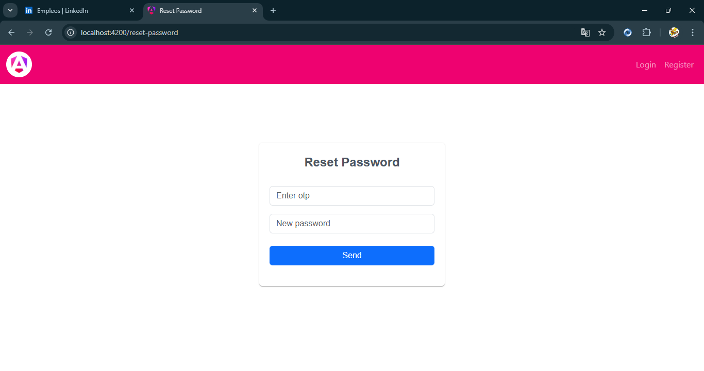
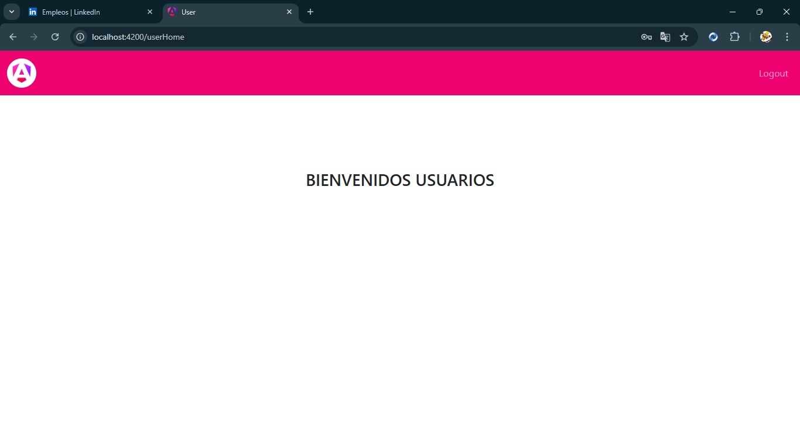
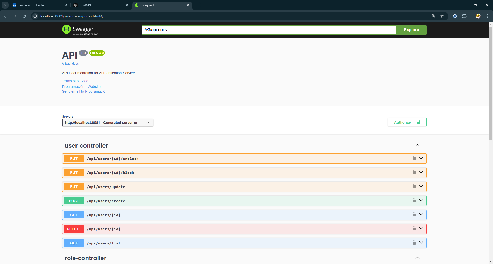

# Authentication

Arquitectura cliente-servidor utilizando el patrón de diseño Builder. En el backend se implementó Java 17 con Spring Boot, y el frontend fue desarrollado con Angular 19.

## Tecnologías Utilizadas

- **Spring Boot**: Para la construcción del servicio backend.
- **Flyway**: Para la gestión de migraciones y la creación de tablas en la base de datos.
- **PostgreSQL**: Base de datos relacional para el almacenamiento de datos.
- **EmailSender**: Utilizado para la funcionalidad de recuperación de contraseñas.
- **Swagger**: Para la documentacion de endpoints.
- **Spring Security**: Para la gestión de seguridad y autenticación.
- **JWT (JSON Web Token)**: Para la autenticación y autorización de usuarios.

# Configuración

En la aplicacion de contraseñas de google crear una contraseña e introducir en el archivo application.properties. Dentro del archivo: /resources/.. se encuentran el script para la creacion de tablas

- El servicio se deplega en el puerto 8081

#### Ruta para acceder a Swagger del servicio

```
  http://localhost:8081/api/swagger-ui/index.html#/
```

### Ruta para acceder al frontend(Angular)
```
  http://localhost:4200/
```
 
## Imagenes








